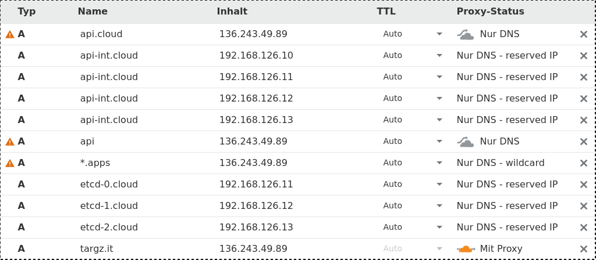

# OpenShift 4 IPI KVM install with Libvirt on a Hetzner root server

## Libvirt pre reqs

Follow [Libvirt HOWTO](https://github.com/openshift/installer/tree/master/docs/dev/libvirt).

## Building installer binary

```text
$ go get github.com/openshift/installer
$ cd go/src/github.com/openshift/installer/
$ # choose branch according to version
$ git checkout release-4.3
$ TAGS=libvirt hack/build.sh
```

## Configure the installer

Check [https://openshift-release.svc.ci.openshift.org/](https://openshift-release.svc.ci.openshift.org/) for latest release version

```text
$ env TF_VAR_libvirt_master_memory=16384 TF_VAR_libvirt_master_vcpu=8 \
OPENSHIFT_INSTALL_RELEASE_IMAGE_OVERRIDE=registry.svc.ci.openshift.org/ocp/release:4.3.1 \
openshift-install --dir=libvirt-install --log-level debug \
create install-config
```

Configure the installer for your cluster instance. Ensure you have a SSH public key available which can be used to SSH into the VMs later:

```text
? SSH Public Key /root/.ssh/id_rsa.pub  
? Platform libvirt
? Libvirt Connection URI [? for help] (qemu+tcp://192.168.122.1/system) 
? Base Domain targz.it
? Cluster Name cloud
```

Copy & Paste your Pull Secret from [https://cloud.redhat.com/openshift/](https://cloud.redhat.com/openshift/)

```text
? Pull Secret [? for help] ************.....
```

Before actually creating the cluster we need some tweaking. Edit the number of replicas which get created. In this case we will create 3 master and 2 worker nodes:

```text
$ vi libvirt-install/install-config.yaml
.
.
.
compute:
- hyperthreading: Enabled
  name: worker
  platform: {}
  replicas: 2
controlPlane:
  hyperthreading: Enabled
  name: master
  platform: {}
  replicas: 3
.
.
.
```

Now generate the manifests:

```text
$ env TF_VAR_libvirt_master_memory=16384 TF_VAR_libvirt_master_vcpu=8 \
OPENSHIFT_INSTALL_RELEASE_IMAGE_OVERRIDE=registry.svc.ci.openshift.org/ocp/release:4.3.1 \
openshift-install --dir=libvirt-install --log-level debug \
create manifests
```

Fix the domain of the Ingress object and remove the cluster name \(_cloud_ in this case\):

```text
$ cat libvirt-install/manifests/cluster-ingress-02-config.yml
apiVersion: config.openshift.io/v1
kind: Ingress
metadata:
  creationTimestamp: null
  name: cluster
spec:
  domain: apps.ocp4.targz.it
status: {}
$ sed -i.bak '{/domain/s#cloud\.##;}' libvirt-install/manifests/cluster-ingress-02-config.yml
$ diff -u libvirt-install/manifests/cluster-ingress-02-config.yml*
--- libvirt-install/manifests/cluster-ingress-02-config.yml     2020-02-06 20:14:38.558104166 +0100
+++ libvirt-install/manifests/cluster-ingress-02-config.yml.bak 2020-02-06 20:14:23.207398107 +0100
@@ -4,5 +4,5 @@
   creationTimestamp: null
   name: cluster
 spec:
-  domain: apps.targz.it
+  domain: apps.cloud.targz.it
 status: {}

```

Increase the worker node memory to fully utilize your server:

In this case I have a system with a total of 256GB RAM ... minus 3x 16GB \(=48GB\) master memory ... so we can easily assign 96GB RAM \(96\*1024\) per worker node:

```text
$ grep Memory libvirt-install/openshift/99_openshift-cluster-api_worker-machineset-0.yaml 
          domainMemory: 7168
$ sed -i.bak '{/domainMemory/s#7168#98304#;}' libvirt-install/openshift/99_openshift-cluster-api_worker-machineset-0.yaml
$ diff -u libvirt-install/openshift/99_openshift-cluster-api_worker-machineset-0.yaml*
--- libvirt-install/openshift/99_openshift-cluster-api_worker-machineset-0.yaml 2020-02-06 18:46:21.076946167 +0100
+++ libvirt-install/openshift/99_openshift-cluster-api_worker-machineset-0.yaml.bak     2020-02-06 18:21:29.938291920 +0100
@@ -30,7 +30,7 @@
           apiVersion: libvirtproviderconfig.openshift.io/v1beta1
           autostart: false
           cloudInit: null
-          domainMemory: 98304
+          domainMemory: 7168
           domainVcpu: 4
           ignKey: ""
           ignition:
```

## Prep Cloudflare

Before starting the installation we need to publish the necessary DNS entries. I use Cloudflare which also provides DDOS protection:



## Prep HAProxy

We use HAProxy as a loadbalancer into our private libvirt network \(192.168.126.0/24\).

```text
frontend  http 
    bind *:80
    default_backend             http
    option forwardfor       except 127.0.0.0/8
    option                  httplog
frontend  https 
    bind *:443
    mode                        tcp
    default_backend             https
frontend  api 
    bind *:6443
    mode                        tcp
    default_backend             api
.
.
.
backend http
    balance     roundrobin
    server  worker1 192.168.126.51:80 check
    server  worker2 192.168.126.52:80 check
backend https
    balance     roundrobin
    mode        tcp
    server  worker1 192.168.126.51:443 check
    server  worker2 192.168.126.52:443 check
backend api
    balance     roundrobin
    mode        tcp
    server  master0 192.168.126.11:6443 check
    server  master1 192.168.126.12:6443 check
    server  master2 192.168.126.13:6443 check
.
.
.
```

I usually enable the statistics page as well:

```text
frontend stats
  bind *:1936
  mode http
  stats enable
  stats uri /stats
```

On a [SELinux enabled system](https://stopdisablingselinux.com/) you have to announce your non-standard HTTP ports otherwise haproxy will fail to start:

```text
$ semanage port --add --type http_port_t --proto tcp 1936
$ semanage port --add --type http_port_t --proto tcp 6443
```

Once done enable and start the service:

```text
$ systemctl enable haproxy.service 
Created symlink /etc/systemd/system/multi-user.target.wants/haproxy.service � /usr/lib/systemd/system/haproxy.service.
$ systemctl start haproxy.service 
```

## Prep host firewall

```text
$ firewall-cmd --add-port=443/tcp --permanent
$ firewall-cmd --add-port=80/tcp --permanent
$ firewall-cmd --add-port=6443/tcp --permanent
$ firewall-cmd --zone=libvirt --add-port=80/tcp --permanent                                                     
$ firewall-cmd --zone=libvirt --add-port=443/tcp --permanent  
$ firewall-cmd --reload
```

## Create the cluster

### Start the install

```text
$ env TF_VAR_libvirt_master_memory=16384 TF_VAR_libvirt_master_vcpu=8 \
OPENSHIFT_INSTALL_RELEASE_IMAGE_OVERRIDE=registry.svc.ci.openshift.org/ocp/release:4.3.1 \
openshift-install --dir=libvirt-install --log-level debug \
create cluster
```

### Ensure access to Red Hat's container images

We need to login to the generated VMs. Ensure you're using the **core** user:

```text
$ cat .ssh/config 
Host 192.168.126.*
  User core
```

We now have the following VMs available:

```text
$ virsh list
 Id    Name                           State
----------------------------------------------------
 5     ocp4-xpgbs-master-2            running
 6     ocp4-xpgbs-master-0            running
 7     ocp4-xpgbs-master-1            running
 8     ocp4-xpgbs-bootstrap           running
```

These are the assigned IPs:

```text
$ ip n
192.168.126.13 dev tt0 lladdr 52:54:00:86:9e:47 REACHABLE
192.168.126.12 dev tt0 lladdr 52:54:00:32:9e:7f REACHABLE
192.168.126.11 dev tt0 lladdr 52:54:00:3a:eb:d3 REACHABLE
192.168.126.10 dev tt0 lladdr 52:54:00:ea:cf:80 REACHABLE
```

First login to the bootstrap node \(192.168.126.10\). If you logged in before your key will not match, just remove it from known\_hosts:

```text
$ ssh 192.168.126.10                                                                                             
@@@@@@@@@@@@@@@@@@@@@@@@@@@@@@@@@@@@@@@@@@@@@@@@@@@@@@@@@@@                                                                   
@    WARNING: REMOTE HOST IDENTIFICATION HAS CHANGED!     @                                                                   
@@@@@@@@@@@@@@@@@@@@@@@@@@@@@@@@@@@@@@@@@@@@@@@@@@@@@@@@@@@                                                                   
IT IS POSSIBLE THAT SOMEONE IS DOING SOMETHING NASTY!                                                                         
Someone could be eavesdropping on you right now (man-in-the-middle attack)!                                                   
It is also possible that a host key has just been changed.                                                                    
The fingerprint for the ECDSA key sent by the remote host is                                                                  
SHA256:vtarQorJlxZ8Cj9CmtukcZDh2qEbWVETc5IJEvDgdZ4.                                                                           
Please contact your system administrator.                                                                                     
Add correct host key in /root/.ssh/known_hosts to get rid of this message.
Offending ECDSA key in /root/.ssh/known_hosts:1
ECDSA host key for 192.168.126.10 has changed and you have requested strict checking.                                        
Host key verification failed.                                                                                         
$ sed -i.bak '{1d;}' ~/.ssh/known_hosts
```

Login to [https://api.ci.openshift.org/console/catalog](https://api.ci.openshift.org/console/catalog) and copy the oc login command by clicking on your username and choosing the corresponding menu item.

Paste it into the shell of the bootstrap node. Attention ... you need to be root!

```text
[root@rhel ~]# ssh 192.168.126.10                                                                                            
The authenticity of host '192.168.126.10 (192.168.126.10)' can't be established.
ECDSA key fingerprint is SHA256:vtarQorJlxZ8Cj9CmtukcZDh2qEbWVETc5IJEvDgdZ4.
Are you sure you want to continue connecting (yes/no/[fingerprint])? yes
Warning: Permanently added '192.168.126.10' (ECDSA) to the list of known hosts.
Red Hat Enterprise Linux CoreOS 43.81.202001142154.0
  Part of OpenShift 4.3, RHCOS is a Kubernetes native operating system
  managed by the Machine Config Operator (`clusteroperator/machine-config`).

WARNING: Direct SSH access to machines is not recommended; instead,
make configuration changes via `machineconfig` objects:
  https://docs.openshift.com/container-platform/4.3/architecture/architecture-rhcos.html

---
This is the bootstrap node; it will be destroyed when the master is fully up.

The primary service is "bootkube.service". To watch its status, run e.g.

  journalctl -b -f -u bootkube.service
[core@ocp4-xpgbs-bootstrap ~]$ sudo su -
[root@ocp4-xpgbs-bootstrap ~]# oc login https://api.ci.openshift.org --token=<my_removed_token>     
Logged into "https://api.ci.openshift.org:443" as "<username>" using the token provided.                                         

You have access to the following projects and can switch between them with 'oc project <projectname>':                       

    ci
    ci-stg
    coreos
    fcos
    ocp
    ocp-ppc64le
    ocp-s390x
    origin
    origin-web-console
    release-controller-test-release

Using project "".
Welcome! See 'oc help' to get started.
```

Then do:

```text
[root@ocp4-xpgbs-bootstrap ~]# oc registry login
info: Using registry public hostname registry.svc.ci.openshift.org                                                           
Saved credentials for registry.svc.ci.openshift.org
```

Repeat these steps for the master nodes once fully started:

1. master-0 \(192.168.126.11\)
2. master-1 \(192.168.126.12\)
3. master-2 \(192.168.126.13\)

Check for worker nodes to be provisioned:

```text
$ virsh list
 Id    Name                           State
----------------------------------------------------
 5     ocp4-xpgbs-master-2            running
 6     ocp4-xpgbs-master-0            running
 7     ocp4-xpgbs-master-1            running
 8     ocp4-xpgbs-bootstrap           running
 9     ocp4-xpgbs-worker-0-wc65z      running
 10    ocp4-xpgbs-worker-0-2xkxt      running
```

```text
$ ip n
192.168.126.52 dev tt0 lladdr 32:30:c9:fb:f2:61 REACHABLE
192.168.126.51 dev tt0 lladdr d2:f8:67:a8:5a:cc REACHABLE
192.168.126.13 dev tt0 lladdr 52:54:00:86:9e:47 REACHABLE
192.168.126.12 dev tt0 lladdr 52:54:00:32:9e:7f REACHABLE
192.168.126.11 dev tt0 lladdr 52:54:00:3a:eb:d3 REACHABLE
192.168.126.10 dev tt0 lladdr 52:54:00:ea:cf:80 DELAY
```

Once worker nodes are fully started, repeat above steps:

1. worker-0-xxxxx \(192.168.126.51\)
2. worker-0-zzzzz \(192.168.126.52\)

### Wait for completion

If your install run times out you can easily reconnect with:

```text
$ openshift-install --dir=libvirt-install --log-level debug wait-for install-complete                           
DEBUG OpenShift Installer unreleased-master-2228-gddb3d0e6cbafd3aeba73fa5bfe8a5609c7557dfb                                   
DEBUG Built from commit ddb3d0e6cbafd3aeba73fa5bfe8a5609c7557dfb
INFO Waiting up to 30m0s for the cluster at https://api.cloud.targz.it:6443 to initialize...                                 
DEBUG Still waiting for the cluster to initialize: Some cluster operators are still updating: authentication, console   
DEBUG Cluster is initialized
INFO Waiting up to 10m0s for the openshift-console route to be created...                                                    
DEBUG Route found in openshift-console namespace: console
DEBUG Route found in openshift-console namespace: downloads
DEBUG OpenShift console route is created
INFO Install complete!
INFO To access the cluster as the system:admin user when using 'oc', run 'export KUBECONFIG=/root/libvirt-install/auth/kubeconfig'
INFO Access the OpenShift web-console here: https://console-openshift-console.apps.targz.it                                  
INFO Login to the console with user: <my-removed-user>, password: <my-removed-password>
```

Congrats on your new OpenShift 4 Cluster!

